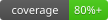

<h1 align="center">
  <a href="https://dontwordle.com/">
    
  </a>
  <br>
  Don't Wordle Assistant
</h1>

<p align="center">
  <strong>
    An unofficial, spoiler-free assistant for
    <a href="https://dontwordle.com/">Don't Wordle</a> that ranks every legal next guess.
  </strong>
</p>

<p align="center">
  <a href="https://github.com/murfalo/dontwordle-assistant/actions/workflows/ci.yml"></a>
  
  
</p>

## Getting started

```bash
git clone git@github.com:murfalo/dontwordle-assistant.git
cd dontwordle-assistant
uv run dontwordle
```

After each turn, enter your guess and its feedback:

```text
> QAJAQ bbbbb
```

Feedback uses `b` for gray, `y` for yellow, and `g` for green. Colored-square
emoji work too. Pass `--undos 2` for Hard Mode.
